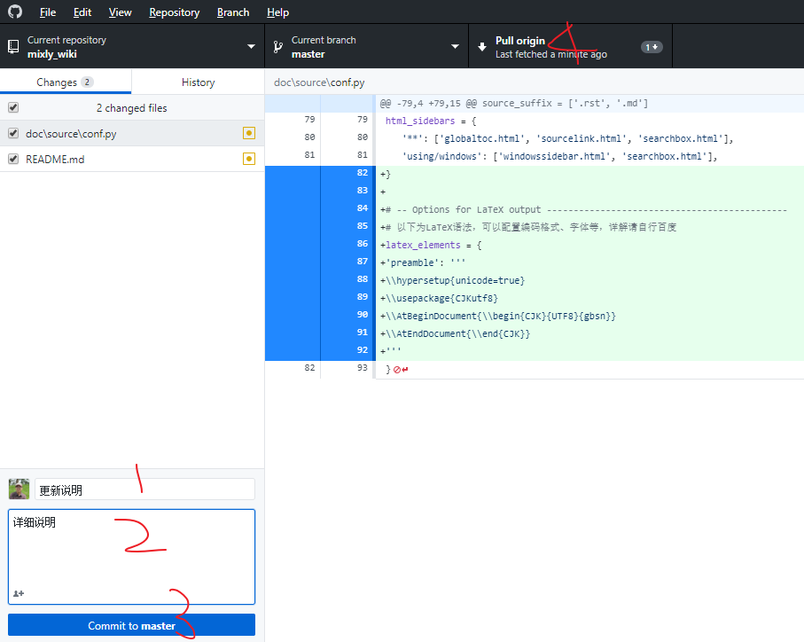

# Mixly Wiki 

## Mixly Wiki 编写准备

### 注册github账号
https://github.com/join?source=header-home

### 安装github同步软件github-desktop 
https://desktop.github.com/

### 安装好用的文本编辑器sublime
http://www.sublimetext.com/

### 克隆项目到本地
* 打开github-desktop 软件，依次点击：File-Clone a Repository-URL，在URL中输入https://github.com/hznupeter/mixly_wiki.git
* 设置项目本地存储地址


## 编写项目
* 打开github-desktop 软件，依次点击Repository-open in sublime Text,用sublime打开该项目进行编辑。


## 项目目录说明
```
|--doc
   |--build  /*生成目录*/
      |--doctrees
      |--gettext
      |--html
   |--source /*源文件目录*/
      |--_static /*静态html文件目录*/
      |--_templates /*自定义模板目录*/
      |--arduino /*arduino部分wiki目录*/
         |--images /*arduino引用图片*/
            |--02  /*02.XXX.rst 文件引用的图片目录*/
               |-- analogRead.png /*所有图片都用png格式，文件命名格式为该函数名*/
               |-- analogRead-example.png /*模块使用范例截图*/
               |-- analogRead.en.png /*analogRead.png对应的英文图片*/
               |-- analogRead-example.en.png /*analogRead-example.png对应的英文图片*/
      |--basic /*软件基础部分wiki目录*/
      |--locale /*多语言目录*/
      |--MicroPython /*micropython部分wiki目录*/
      |--Python /*python部分wiki目录*/

```
以 arduino为例进行目录说明，arduino目录中包含多个rst文件，rst为wiki的核心文件，通过编辑该类文件创建wiki。

在编写mixly wiki过程中可以参考 arduino语法。

编写wiki所使用rst文档采用的是Sphinx，常用语法可以参考下面链接。https://www.cnblogs.com/zzqcn/p/5096876.html#_label7
## Arduino 语法参考
http://www.cnblogs.com/xczr/p/7832015.html

https://www.arduino.cc/reference/en/


## wiki编写说明
根据mixly模块顺序，介绍每一个模块。包括截图、描述、参数、返回值、范例、注释（注意点）。

编写文件可以参考```source\arduino\02.Input-Output.rst```

显示效果可以参考 https://mixly-wiki-test.readthedocs.io/zh_CN/latest/arduino/02.Input-Output.html

## 提交代码

修改文本后，按照下图操作提交代码。


## 本地预览
* 安装python3.x
* 打开cmd，输入以下命令，配置基础环境
```
pip install -U Sphinx
pip install sphinx_rtd_theme
pip install --upgrade recommonmark
```
* 跳转到本地项目路径，执行生成命令
```
cd Documents\GitHub\mixly_wiki\doc
make html
```

* 打开build/html/index.html本地预览。

## 在线预览
在提交代码之后，浏览https://mixly-wiki-test.readthedocs.io/zh_CN/latest/


## 支持pdf导出(高级应用)

### 安装docker 
https://www.docker.com/
### 更改docker源

在桌面右下角状态栏中右键 docker 图标，修改在 Docker Daemon 标签页中的 json ，把下面的地址:
```http://f1361db2.m.daocloud.io```
加到" registry-mirrors"的数组里。点击 Apply 。
### 编译 Dockerfile
打开cmd，运行
```
docker pull iccccing/shpinx-pdf-zh
```
### 更改配置文件

为了满足中文编码的支持，需要在config.py中设置如下参数：
```
# -- Options for LaTeX output ---------------------------------------------
# 以下为LaTeX语法，可以配置编码格式、字体等，详解请自行百度
latex_elements = {
'preamble': '''
\\hypersetup{unicode=true}
\\usepackage{CJKutf8}
\\AtBeginDocument{\\begin{CJK}{UTF8}{gbsn}}
\\AtEndDocument{\\end{CJK}}
'''
}

```
### 运行容器
打开cmd，运行:
c/Users/Peter/Documents/GitHub/mixly_wiki/doc 为doc路径
```
docker run -it -v c/Users/Peter/Documents/GitHub/mixly_wiki/doc:c/Users/Peter/Documents/GitHub/mixly_wiki/doc --name my-sphinx iccccing/sphinx-pdf-zh

```

### 进入容器
docker exec -it my-sphinx bash

### 开始编译
```
make latexpdf
```
### 查看文件

进入编译结果目录_xxx/latex可以看到xxx.pdf文件
readme