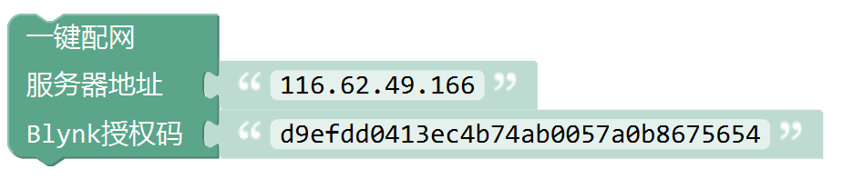

Bylnk IOT
=====================

Blynk IOT类别中包含了用所有跟Blynk物联网平台相关的命令。如网络连接，发送数据，接受数据，控制组件等。

.. image:: images/16/blynk.png

准备工作
------------------
Blynk App 下载

安卓用户扫描下方二维码下载Blynk App

.. image:: images/16/app_QR.png

.. Attention::
	请不要使用微信扫描该二维码，微信会屏蔽该二维码。可以使用手机浏览器自带的二维码扫描功能。

苹果用户直接在app store 中搜索blynk并下载。

.. image:: images/16/apple_app.png

Blynk账号注册
-----------------
安装好APP之后，进入app首页，点击Create New Account,输入邮箱和密码。

如果要注册国内服务器或者本地服务器的账号，在下方设置中将服务器地址改成本地服务器地址。

.. image:: images/16/sign_up.png

Blynk账号登录
-----------------

注册好账号之后，就可以登录Blynk App了。

.. image:: images/16/sign_in.png

服务器信息
--------------

.. image:: images/16/server_info.png

.. code-block:: c
	:linenos:

	#define BLYNK_PRINT Serial
	#include <BlynkSimpleEsp8266.h>
	#include <ESP8266WiFi.h>
	#include <TimeLib.h>
	#include <WidgetRTC.h>
	char auth[] = "d9efdd0413ec4b74ab0057a0b8675654";
	char pass[] = "wifi-pass";
	char ssid[] = "wifi-ssid";
	void setup(){
		Serial.begin(9600);
		Blynk.begin(auth, ssid, pass,IPAddress(116,62,49,166),8080);
	}
	void loop(){
		Blynk.run();
	}

描述
++++++++++++++

.. note::
	用于配置ESP8266 开发板连接Blynk服务器。

.. Attention::
	注意：服务器地址使用IP时，间隔符为英文逗号(,)。

参数
+++++++++++++++

* 服务器地址：Blynk服务器地址，Blynk官方地址:blynk-cloud.com;Blynk 国内服务器地址：116,62,49,166;也可以使用您自己的本地服务器。
* Wi-Fi名称:开发板需要连接的Wi-Fi名称。
* Wi-Fi密码:开发板需要连接的Wi-Fi的密码。
* Blynk授权码：通过Blynk App内创建项目而产生的唯一授权码。

一键配网
--------------

.. code-block:: c
	:linenos:

	#define BLYNK_PRINT Serial
	#include <BlynkSimpleEsp8266.h>
	#include <ESP8266WiFi.h>
	#include <TimeLib.h>
	#include <WidgetRTC.h>
	char auth[] = "d9efdd0413ec4b74ab0057a0b8675654";
	void setup(){
		Serial.begin(9600);
		WiFi.mode(WIFI_STA);
		int cnt = 0;
		while (WiFi.status() != WL_CONNECTED) {
			delay(500);
			Serial.print(".");
			if (cnt++ >= 10) {
				WiFi.beginSmartConfig();
				while (1) {
					delay(1000);
					if (WiFi.smartConfigDone()) {
						Serial.println();
						Serial.println("SmartConfig: Success");
						break;
					}
					Serial.print("|");
				}
			}
		}  WiFi.printDiag(Serial);
		Blynk.config(auth,IPAddress(116,62,49,166),8080);
	}
	void loop(){
		Blynk.run();
	}

描述
++++++++++++++

.. note::
	在编写程序时不确定wifi信息，等到程序上传之后，再通过手机app或者微信公众号给开发板配网。
	方便在上传完程序后，依然可以更改wifi信息。

.. Attention::
	注意：服务器地址使用IP时，间隔符为英文逗号(,)。

参数
+++++++++++++++

* 服务器地址：Blynk服务器地址，Blynk官方地址:blynk-cloud.com;Blynk 国内服务器地址：116,62,49,166;也可以使用您自己的本地服务器。
* Blynk授权码：通过Blynk App内创建项目而产生的唯一授权码。

配网方式
+++++++++++++++++++++

关注安信可微信公众号

