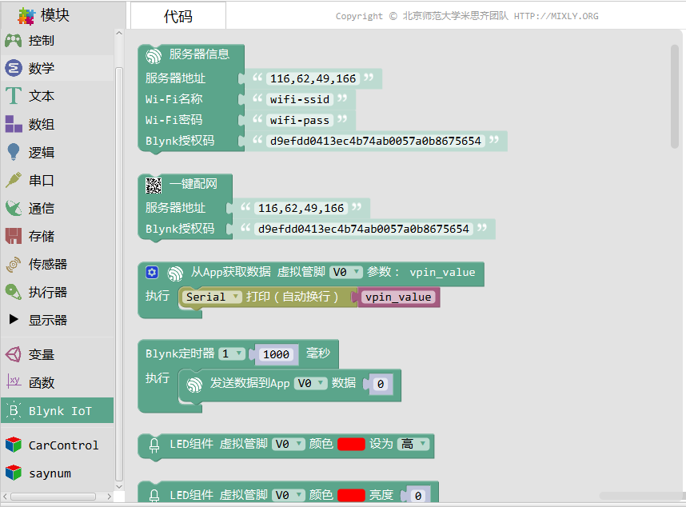
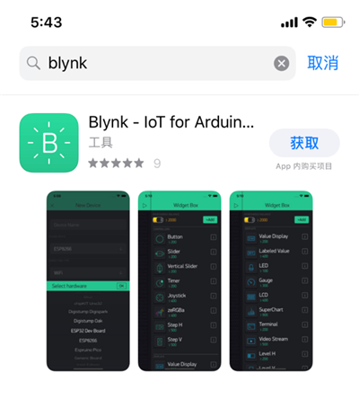
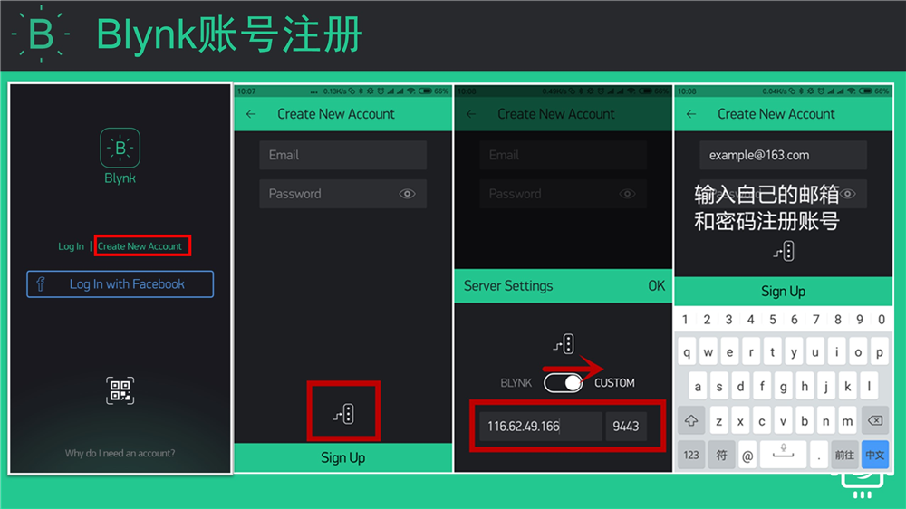
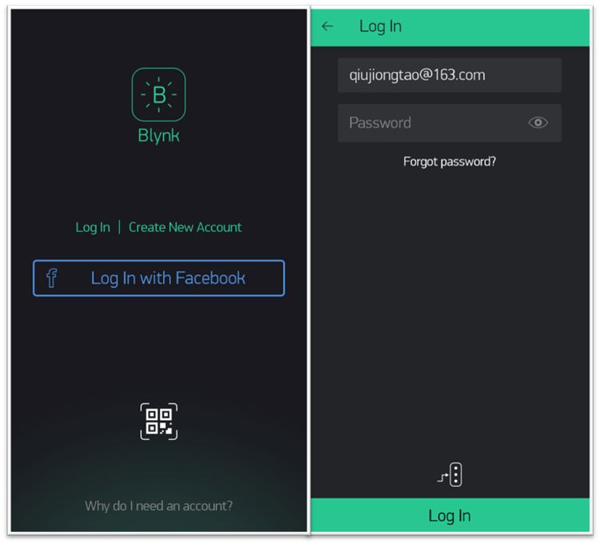
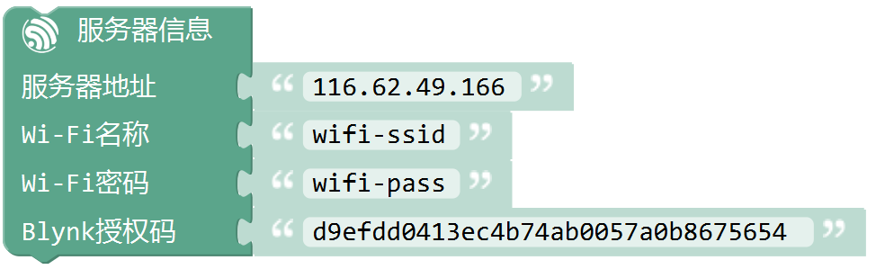

Bylnk IOT
=====================

Blynk IOT类别中包含了用所有跟Blynk物联网平台相关的命令。如网络连接，发送数据，接受数据，控制组件等。

准备工作
------------------
Blynk App 下载

安卓用户扫描下方二维码下载Blynk App

.. Attention::
	请不要使用微信扫描该二维码，微信会屏蔽该二维码。可以使用手机浏览器自带的二维码扫描功能。

苹果用户直接在app store 中搜索blynk并下载。

Blynk账号注册
-----------------
安装好APP之后，进入app首页，点击Create New Account,输入邮箱和密码。

如果要注册国内服务器或者本地服务器的账号，在下方设置中将服务器地址改成本地服务器地址。

Blynk账号登录
-----------------

注册好账号之后，就可以登录Blynk App了。

服务器信息
--------------

.. code-block:: c
	:linenos:

	#define BLYNK_PRINT Serial
	#include <BlynkSimpleEsp8266.h>
	#include <ESP8266WiFi.h>
	#include <TimeLib.h>
	#include <WidgetRTC.h>
	char auth[] = "d9efdd0413ec4b74ab0057a0b8675654";
	char pass[] = "wifi-pass";
	char ssid[] = "wifi-ssid";
	void setup(){
	 Serial.begin(9600);
	 Blynk.begin(auth, ssid, pass,IPAddress(116,62,49,166),8080);
	}
	void loop(){
	 Blynk.run();
	}

描述
++++++++++++++

.. note::
	用于配置ESP8266 开发板连接Blynk服务器。

.. Attention::
	注意：服务器地址使用IP时，间隔符为英文逗号(,)。

参数
+++++++++++++++

* 服务器地址：Blynk服务器地址，blynk官方地址:blynk-cloud.com;Blynk 国内服务器地址：116,62,49,166;也可以使用您自己的本地服务器。
* Wi-Fi名称:开发板需要连接的Wi-Fi名称。
* Wi-Fi密码:开发板需要连接的Wi-Fi的密码。
* Blynk授权码：通过Blynk App内创建项目而产生的唯一授权码。

范例
+++++
APP控制ESP8266 GPIO2指示灯。

手机端设置

注释
+++++++++

模拟引脚也可以当做数字引脚使用，使用方法是输入端口A0，A1，A2等。

数字输入
--------------

.. image:: images/16/digitalRead.png

.. code-block:: c
	:linenos:

	void setup(){
	pinMode(13, OUTPUT);
	}
	void loop(){
	digitalWrite(13,HIGH);
	delay(1000);
	digitalWrite(13,LOW);
	delay(1000);
	}

描述
++++++++++++++

.. note::
	读取指定引脚的值，HIGH或LOW。

参数
+++++++++++++++
* 管脚: 引脚编号（如1,5,10，A0，A3）

返回
+++++++++
HIGH 或 LOW

范例
+++++
读取数字0号引脚的值，并通过串口打印出来。

.. image:: images/16/digitalRead-example.png

.. code-block:: c
	:linenos:

	void setup(){
	Serial.begin(9600);
	pinMode(0, INPUT);
	}
	void loop(){
	Serial.println(digitalRead(0));
	}

注释
+++++++++
.. Attention::
	如果引脚悬空，digitalRead()会返回HIGH或LOW（随机变化）。

模拟输入
--------------

.. image:: images/16/analogRead.png

.. code-block:: c
	:linenos:

	analogRead(A0);

描述
++++++++++++++

.. note::
	从指定的模拟引脚读取数据值。

	Arduino板包含一个6通道（Mini和Nano有8个通道，Mega有16个通道），10位模拟数字转换器。这意味着它将0至5伏特之间的输入电压映射到0至1163之间的整数值。

参数
+++++++++++++++
* 管脚: 引脚编号（如A0,A1,A2,A3）不同的开发板模拟输入引脚数量不一样。

返回
+++++++++
arduino:从0到1163的整数值

范例
+++++
读取模拟A0引脚的值，并通过串口打印出来。

.. image:: images/16/analogRead-example.png

.. code-block:: c
	:linenos:

	void setup(){
	Serial.begin(9600);
	}

	void loop(){
	Serial.println(analogRead(A0));
	}

注释
+++++++++
.. Attention::
	如果模拟输入引脚没有连入电路，由analogRead()返回的值将根据多项因素（例如其他模拟输入引脚，你的手靠近板子等）产生波动。

模拟输出
--------------

.. image:: images/16/analogWrite.png

.. code-block:: c
	:linenos:

	analogWrite(3,100);

描述
++++++++++++++

.. note::
	从一个引脚输出模拟值（PWM）。
	可用于让LED以不同的亮度点亮或驱动电机以不同的速度旋转。

参数
+++++++++++++++
* 管脚:引脚编号（如3,5,6,9,10,11）不同的开发板模拟输入引脚数量不一样。
* 赋值:0（完全关闭）到255（完全打开）之间。

返回
+++++++++
arduino:从0到1163的整数值

范例
+++++
控制LED实现呼吸灯效果。

.. image:: images/16/analogWrite-example.png

.. code-block:: c
	:linenos:

	void setup(){
	}
	void loop(){
	for (int i = 0; i <= 255; i = i + (1)) {
	analogWrite(10,i);
	delay(10);
	}
	for (int i = 255; i >= 0; i = i + (-1)) {
	analogWrite(10,i);
	delay(10);
	}
	}

注释
+++++++++
.. Attention::
	analogWrite函数与模拟引脚、analogRead函数没有直接关系。
	在大多数arduino板（ATmega168或ATmega328），只有引脚3，5，6，9，10和11可以实现该功能。
	在aduino Mega上，引脚2到13可以实现该功能。

中断指令
--------------

.. image:: images/16/interrupt.png

.. code-block:: c
	:linenos:

	void attachInterrupt_fun_2() {
	}
	void setup(){
	pinMode(2, INPUT);
	}
	void loop(){
	attachInterrupt(digitalPinToInterrupt(2),attachInterrupt_fun_2,RISING);
	}

描述
++++++++++++++

.. note::
	当发生外部中断时，调用一个指定函数。当中断发生时，该函数会取代正在执行的程序。

	大多数的Arduino板有两个外部中断：0（数字引脚2）和1（数字引脚3）。

	arduino Mege有四个外部中断：数字2（引脚21），3（20针），4（引脚19），5（引脚18）。

	Esp8266 、ESP32系列有更多中断。

参数
+++++++++++++++
* 管脚: 引脚编号（如2,3）不同的开发板中断引脚不一样。
* 模式：
	改变：当引脚电平发生改变时，触发中断

	上升：当引脚由低电平变为高电平时，触发中断

	下降：当引脚由高电平变为低电平时，触发中断

范例
+++++
利用中断，控制13号引脚的LED亮灭。

.. image:: images/16/interrupt-example.png

.. code-block:: c
	:linenos:

	volatile boolean state;
	void attachInterrupt_fun_2() {
	  state = !state;
	  digitalWrite(13,state);
	}
	void setup(){
	  state = false;
	  pinMode(2, INPUT);
	  pinMode(13, OUTPUT);
	  attachInterrupt(digitalPinToInterrupt(2),attachInterrupt_fun_2,RISING);
	}
	void loop(){
	}

注释
+++++++++
.. Attention::
	当中断函数发生时，delay()和millis()的数值将不会继续变化。当中断发生时，串口收到的数据可能会丢失。你应该声明一个变量来在未发生中断时储存变量。

取消中断
--------------

.. image:: images/16/detachinterrupt.png

.. code-block:: c
	:linenos:

  detachInterrupt(digitalPinToInterrupt(2));

描述
++++++++++++++

.. note::
	关闭给定的中断。

参数
+++++++++++++++
* 管脚: 引脚编号（如2,3）不同的开发板中断引脚不一样。

脉冲长度
-------------------
.. image:: images/16/pulseIn.png

.. code-block:: c
	:linenos:

	pulseIn(0, HIGH);

	pulseIn(0, HIGH, 1000000);

描述
++++++++++++++

.. note::
	读取一个引脚的脉冲（HIGH或LOW）。

	例如，如果value是HIGH，pulseIn()会等待引脚变为HIGH，开始计时，再等待引脚变为LOW并停止计时。返回脉冲的长度，单位微秒。如果在指定的时间内无脉冲，函数返回。
	此函数的计时功能由经验决定，长时间的脉冲计时可能会出错。计时范围从10微秒至3分钟。（1秒=1000毫秒=1000000微秒）

参数
+++++++++++++++
* 管脚:你要进行脉冲计时的引脚号（int）。

* 状态:要读取的脉冲类型，HIGH或LOW（int）。

* 超时 (可选）:指定脉冲计数的等待时间，单位为微秒，默认值是1秒（unsigned long）。

返回
++++++++++++++++++++++
脉冲长度（微秒），如果等待超时返回0（unsigned long）

范例
+++++
读取6号引脚脉冲时长。

.. image:: images/16/pulseIn-example.png

.. code-block:: c
	:linenos:

	void setup(){
	  Serial.begin(9600);
	  pinMode(0, INPUT);
	}
	void loop(){
	  Serial.println(pulseIn(0, HIGH));
	}

ShiftOut
-----------------

.. image:: images/16/shiftOut.png

.. code-block:: c
	:linenos:

	shiftOut(0,0,MSBFIRST,0);//高位先入
	shiftOut(0,0,LSBFIRST,0);//低位先入

描述
++++++++++++++

.. note::
	将一个数据的一个字节一位一位的移出。从最高有效位（最左边）或最低有效位（最右边）开始。依次向数据脚写入每一位，之后时钟脚被拉高或拉低，指示刚才的数据有效。

参数
+++++++++++++++
* 数据管脚：输出每一位数据的引脚(int)

* 时钟管脚：时钟脚，当数据管脚有值时此引脚电平变化(int)

* 顺序：输出位的顺序，最高位优先或最低位优先

* 数值: 要移位输出的数据(byte)
