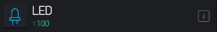

Bylnk IOT
=====================

Blynk IOT类别中包含了用所有跟Blynk物联网平台相关的命令。如网络连接，发送数据，接受数据，控制组件等。

准备工作
------------------
Blynk App 下载

安卓用户扫描下方二维码下载Blynk App

.. image:: images/16/app_QR.png

.. Attention::
	请不要使用微信扫描该二维码，微信会屏蔽该二维码。可以使用手机浏览器自带的二维码扫描功能。

苹果用户直接在app store 中搜索blynk并下载。

.. image:: images/16/apple_app.png

Blynk账号注册
-----------------
安装好APP之后，进入app首页，点击Create New Account,输入邮箱和密码。

如果要注册国内服务器或者本地服务器的账号，在下方设置中将服务器地址改成本地服务器地址。

.. image:: images/16/sign_up.png

Blynk账号登录
-----------------

注册好账号之后，就可以登录Blynk App了。

.. image:: images/16/sign_in.png

服务器信息
--------------

.. image:: images/16/server_info.png

.. code-block:: c
	:linenos:

	#define BLYNK_PRINT Serial
	#include <BlynkSimpleEsp8266.h>
	#include <ESP8266WiFi.h>
	#include <TimeLib.h>
	#include <WidgetRTC.h>
	char auth[] = "d9efdd0413ec4b74ab0057a0b8675654";
	char pass[] = "wifi-pass";
	char ssid[] = "wifi-ssid";
	void setup(){
	  Serial.begin(9600);
	  Blynk.begin(auth, ssid, pass,IPAddress(116,62,49,166),8080);
	}
	void loop(){
	  Blynk.run();
	}

描述
++++++++++++++

.. note::
	用于配置ESP8266 开发板连接Blynk服务器。

.. Attention::
	注意：服务器地址使用IP时，间隔符为英文逗号(,)。

参数
+++++++++++++++

* 服务器地址：Blynk服务器地址，
	* Blynk官方地址:blynk-cloud.com;Blynk 
	* 国内服务器地址：116,62,49,166;也可以使用您自己的本地服务器。
* Wi-Fi名称:开发板需要连接的Wi-Fi名称。
* Wi-Fi密码:开发板需要连接的Wi-Fi的密码。
* Blynk授权码：通过Blynk App内创建项目而产生的唯一授权码。

一键配网
--------------

.. code-block:: c
	:linenos:

	#define BLYNK_PRINT Serial
	#include <BlynkSimpleEsp8266.h>
	#include <ESP8266WiFi.h>
	#include <TimeLib.h>
	#include <WidgetRTC.h>
	char auth[] = "d9efdd0413ec4b74ab0057a0b8675654";
	void setup(){
	  Serial.begin(9600);
	  WiFi.mode(WIFI_STA);
	  int cnt = 0;
	  while (WiFi.status() != WL_CONNECTED) {
	    delay(500);
	    Serial.print(".");
	    if (cnt++ >= 10) {
	      WiFi.beginSmartConfig();
	      while (1) {
	        delay(1000);
	        if (WiFi.smartConfigDone()) {
	          Serial.println();
	          Serial.println("SmartConfig: Success");
	          break;
	        }
	        Serial.print("|");
	      }
	    }
	  }WiFi.printDiag(Serial);
	  Blynk.config(auth,IPAddress(116,62,49,166),8080);
	}
	void loop(){
	  Blynk.run();
	}

描述
++++++++++++++

.. note::
	在编写程序时不确定wifi信息，等到程序上传之后，再通过手机app或者微信公众号给开发板配网。
	方便在上传完程序后，依然可以更改wifi信息。

.. Attention::
	注意：服务器地址使用IP时，间隔符为英文逗号(,)。

参数
+++++++++++++++

* 服务器地址：Blynk服务器地址，Blynk官方地址:blynk-cloud.com;Blynk 国内服务器地址：116,62,49,166;也可以使用您自己的本地服务器。
* Blynk授权码：通过Blynk App内创建项目而产生的唯一授权码。

配网方式
+++++++++++++++++++++

关注安信可微信公众号

.. image:: images/16/anxinke_qr.png

点击右下角的wifi配置

.. image:: images/16/anxinke2.png

点击 开始配置，稍等片刻即可配置完成。

从App获取数据
-----------------------

从app的虚拟管脚获取数据。

.. code-block:: c
	:linenos:

	#define BLYNK_PRINT Serial
	#include <BlynkSimpleEsp8266.h>
	#include <ESP8266WiFi.h>
	#include <TimeLib.h>
	#include <WidgetRTC.h>
	char auth[] = "d9efdd0413ec4b74ab0057a0b8675654";
	int vpin_value;
	char pass[] = "wifi-pass";
	char ssid[] = "wifi-ssid";
	BLYNK_WRITE(V0) {
	  vpin_value= param.asInt();
	  Serial.println(vpin_value);
	}
	void setup(){
	  Serial.begin(9600);
	  Blynk.begin(auth, ssid, pass,IPAddress(116,62,49,166),8080);
	  Serial.begin(9600);
	}
	void loop(){
	  Blynk.run();
	}

描述
++++++++++++++
本模块用于从APP获取虚拟管脚的数值。因此必须在App端设置向该虚拟管脚发送数据。
可以接收的数据类型包括但不限于 整数，浮点数，字符，字符串。

参数
+++++++++++++++

* 传入参数：点开齿轮设置传入参数的变量类型和变量名称。**该处变量为全局变量**
* 虚拟管脚：用于接收数据的虚拟管脚，需要与App端对应。

范例
+++++++++++++++++++++

发送数据到App
-----------------------

发送数据到App的虚拟管脚。

.. code-block:: c
	:linenos:

	#define BLYNK_PRINT Serial
	#include <BlynkSimpleEsp8266.h>
	#include <ESP8266WiFi.h>
	#include <TimeLib.h>
	#include <WidgetRTC.h>
	BlynkTimer timer;
	char auth[] = "d9efdd0413ec4b74ab0057a0b8675654";
	char pass[] = "wifi-pass";
	char ssid[] = "wifi-ssid";
	void myTimerEvent1() {
	  Blynk.virtualWrite(V0,0 );
	}
	void setup(){
	  Serial.begin(9600);
	  Blynk.begin(auth, ssid, pass,IPAddress(116,62,49,166),8080);
	  timer.setInterval(1000L, myTimerEvent1);
	}
	void loop(){
	  Blynk.run();
	  timer.run();
	}

描述
++++++++++++++
本模块用于开发板向App发送数据。因此必须在App端设置相应组件用于接收数据。
可以发送的数据类型包括但不限于 整数，浮点数，字符，字符串。

参数
+++++++++++++++

* 发送数据：需要发送的数据，支持常量和变量。
* 虚拟管脚：用于发送数据的虚拟管脚，需要与App端对应。

范例
+++++++++++++++++++++

LED组件开关
-----------------------

.. code-block:: c
	:linenos:

	WidgetLED ledV0(V0);
	void setup(){
	}
	void loop(){
	  ledV0.setColor("#ff0000");
	  ledV0.on();
	}

描述
++++++++++++++

设置手机端LED组件的颜色和开关。

参数
+++++++++++++++

* 虚拟管脚：App端LED组件的虚拟管脚值。
* 颜色选择：选择LED组件的颜色。
* 开关值：高为开，低为关。

范例
+++++++++++++++++++++

LED组件颜色及亮度设置
-----------------------

.. code-block:: c
	:linenos:

	WidgetLED ledV0(V0);
	void setup(){
	}
	void loop(){
	  ledV0.setColor("#ff0000");
	  ledV0.setValue(0);
	}

描述
++++++++++++++

设置手机端LED组件的颜色和亮度。

参数
+++++++++++++++

* 虚拟管脚：App端LED组件的虚拟管脚值。
* 颜色选择：选择LED组件的颜色。
* 亮度值：设置LED组件亮度，最暗为0，最亮100。

范例
+++++++++++++++++++++

Email组件
-----------------------

.. code-block:: c
	:linenos:

	#define BLYNK_MAX_SENDBYTES 128
	void setup(){
	}
	void loop(){
	  Blynk.email("example@blynk.cc", "Subject", "Content");
	}

描述
++++++++++++++

给指定邮箱发送邮件。

参数
+++++++++++++++

* 邮箱地址：收件人邮箱地址。
* 邮件主题：设置邮件主题，可以加入变量值。
* 邮件内容：设置邮件内容，可以加入变量值。

范例
+++++++++++++++++++++
