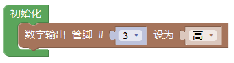
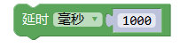
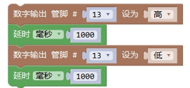

控制
============

控制类别中包括了时间延迟、条件执行、循环执行、获取运行时间、初始化、Switch执行等
控制模块中主要执行的内容是对程序结构进行的相应控制。

初始化
-----------------------

描述
++++++++++++++

.. note::
	在Arduino中程序运行时将首先调用 setup()函数。
	用于初始化变量、设置针脚的输出\输入类型、配置串口、引入类库文件等等。
.. Attention::
	每次 Arduino 上电或重启后，setup 函数只运行一次。

范例
+++++++++

初始化时声明变量。

中断函数需要放在初始化中。

.. code-block:: c
    :linenos:
    :emphasize-lines: 3,6 

    void attachInterrupt_fun_2() {
    digitalWrite(13,HIGH);
    }

    void setup(){
    pinMode(2, INPUT);
    pinMode(13, OUTPUT);
    attachInterrupt(digitalPinToInterrupt(2),attachInterrupt_fun_2,RISING);
    }

    void loop(){

    }

while 循环
---------------

描述
++++++++++++++

.. note::
	while循环会无限的循环，直到括号内的判断语句变为假。
	必须要有能改变判断语句的东西，要不然while循环将永远不会结束。你可以使用一个传感器的值，或者一个变量来控制什么时候停止该循环。

参数
+++++++++++++++
* 满足条件：为真或为假的一个条件。

范例
+++++++++

当温度高于30度时，亮灯，否则灭灯。

延时
---------------

描述
++++++++++++++

.. note::
	使程序暂定设定的时间（单位毫秒）。（一秒等于1000毫秒）。

参数
+++++++++++++++
* 毫秒：暂停的毫秒数（unsigned long）。

范例
+++++++++

13号引脚灯亮1秒，灭1秒，往复循环。

注释
+++++++++++++++
.. Attention::
	虽然创建一个使用delay()的闪烁LED很简单，并且许多例子将很短的delay用于消除开关抖动。

	但delay()确实拥有很多显著的缺点。在delay函数使用的过程中，读取传感器值、计算、引脚操作均无法执行，因此，它所带来的后果就是使其他大多数活动暂停。大多数熟练的程序员通常避免超过10毫秒的delay(),除非arduino程序非常简单。
	
	利用定时器，就可以解决这个问题，可以避免由于delay()带来的CPU暂停，也能很好地实现每隔一定时间执行动作。

循环语句
----------------------
控制循环语句的代码有三条。
分别是：

.. image:: images/03/control9.png
.. image:: images/03/control10.png
.. image:: images/03/control11.png

循环语句的功能就是使某段代码重复运行。比如最常见的呼吸灯（手机提醒灯或者路由器的灯）。呼吸灯的效果是LED由慢慢由灭变量，后又慢慢由亮变灭的一种渐变灯。对于存在中间状态的渐变，用数字输出就无法实现了。

上图就是呼吸灯的代码。Arduino本身支持的模拟输出状态为256种，也就是0——255个数值。步长为每次循环变量增加的幅度。“使用i从0到255 步长为1“可以理解为i将以每次加1的增福由0变化到255。而我们在3号管脚接的LED的值也将是0，1,2,3……最后直到255。第二个循环块原理类似。

系统运行时间
------------------
.. image:: images/03/control13.png

该指令可以读取从代码编程开始到此时的系统时间。

程序范例
-------------------
按下按键显示当前系统运行时间

