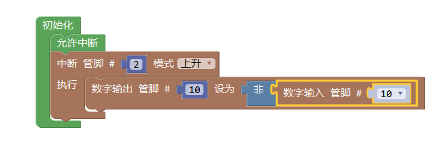
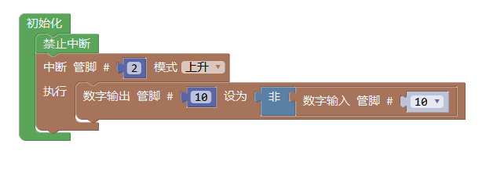

控制 (高级视图)
==================

允许中断
-------------------

描述
++++++++++++++

.. note::
	允许输入/输出模块中管脚中断的运行

用法
+++++++++++++++
主要用于加入禁止中断模块后恢复中断执行。

范例
+++++++++
使用按钮模拟开关，每次按下，LED灯切换亮灭

.. code-block:: c
	:linenos:

	void attachInterrupt_fun_2() {
	  digitalWrite(10,(!digitalRead(10)));
	}
	void setup(){
	  pinMode(2, INPUT);
	  pinMode(10, OUTPUT);
	  interrupts();
	  attachInterrupt(digitalPinToInterrupt(2),attachInterrupt_fun_2,RISING);
	}
	void loop(){
	}

禁止中断
-------------------

描述
++++++++++++++

.. note::
	禁止输入/输出模块中管脚中断的运行

用法
+++++++++++++++
主要用于禁止中断模块的中断执行。

范例
+++++++++
在允许中断范例的基础上，尝试禁止中断

.. code-block:: c
	:linenos:

	void attachInterrupt_fun_2() {
	  digitalWrite(10,(!digitalRead(10)));
	}
	void setup(){
	  pinMode(2, INPUT);
	  pinMode(10, OUTPUT);
	  noInterrupts();
	  attachInterrupt(digitalPinToInterrupt(2),attachInterrupt_fun_2,RISING);
	}
	void loop(){
	}

SCoop Task
-------------------

执行SCoop
------------------

SCoop 延时
------------------